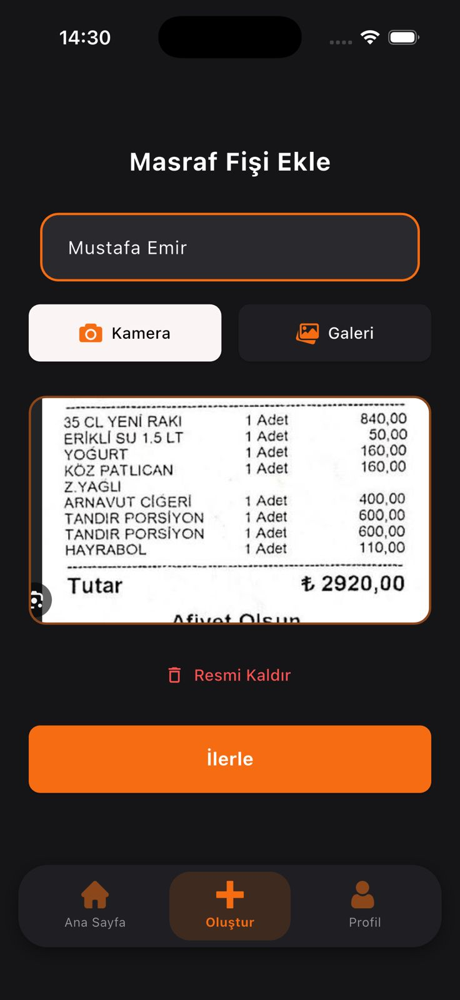
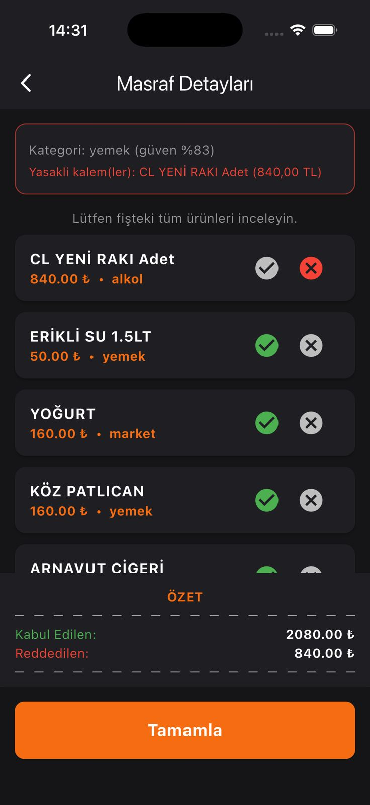
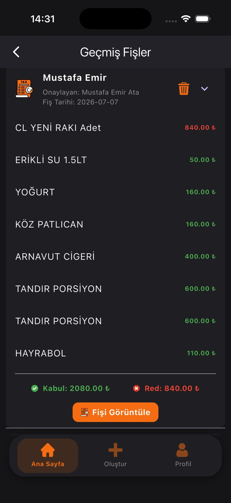
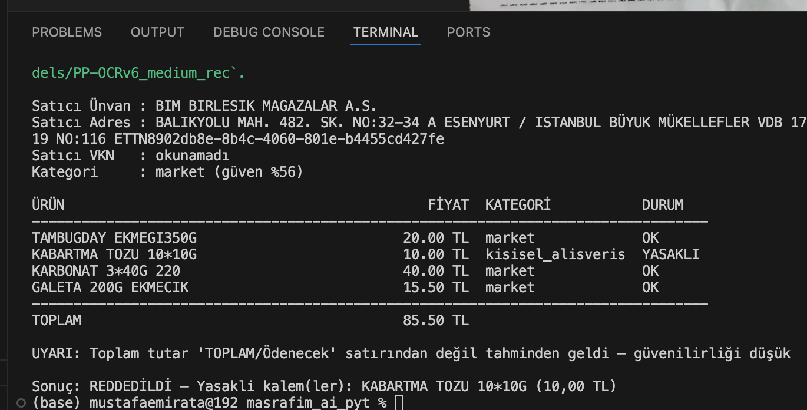
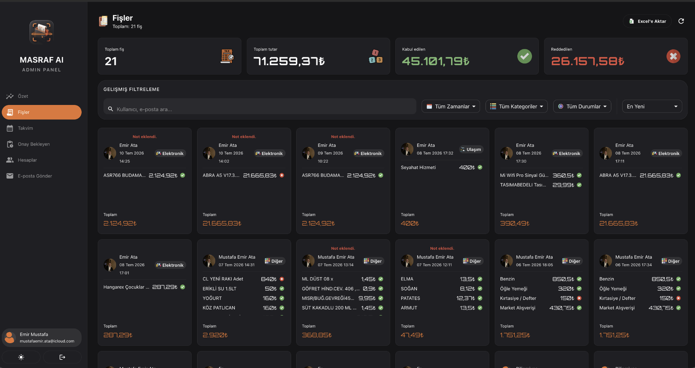
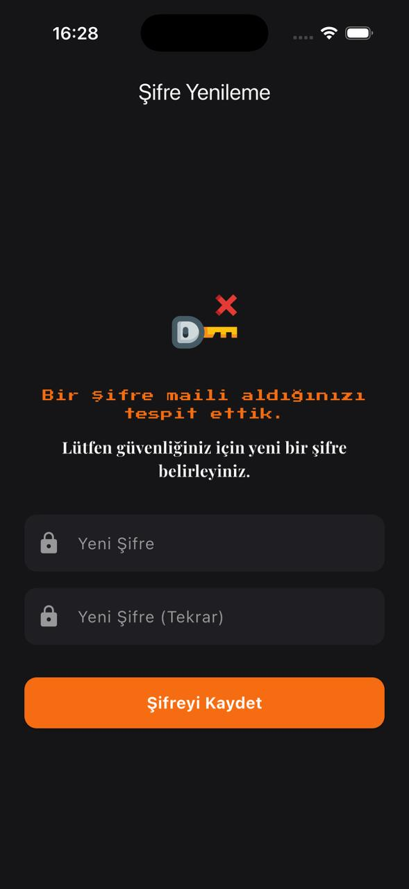
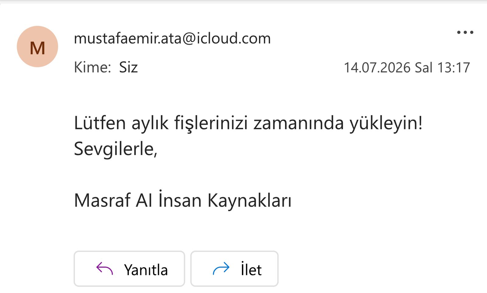

# Masraf-AI

Masraf-AI, kullanıcıların harcama fişlerini fotoğraflayarak sisteme yükleyebildiği, yapay zeka destekli OCR ile fiş verilerini otomatik olarak analiz eden ve sonuçları onay için admine ileten bir masraf yönetim ve takip uygulamasıdır.

Kullanıcılar fişlerini kolayca ekler, sistem fiş üzerindeki bilgileri (tutar, tarih, kalem vb.) otomatik olarak çıkarır ve admin paneli üzerinden yetkili kişi bu masraf kalemlerini onaylayabilir ya da reddedebilir. Böylece kurum içi masraf onay süreçleri dijitalleşir, manuel kontrol yükü azalır.

---

## Özellikler

- **Fiş Ekleme:** Kullanıcılar mobil uygulama üzerinden fiş fotoğrafı çekip yükleyebilir.
- **Otomatik Analiz:** Yüklenen fişler, arka planda çalışan PaddleOCR tabanlı Python API ile otomatik olarak okunup analiz edilir.
- **Geçmiş Fişler:** Kullanıcılar daha önce yükledikleri fişleri ve durumlarını görüntüleyebilir.
- **Admin Onay Süreci:** Analiz edilen masraf kalemleri admin paneline düşer; admin fişleri inceleyip onaylayabilir veya reddedebilir.
- **Sonuç Görüntüleme:** Onaylanan/reddedilen masraflar ve analiz sonuçları kullanıcıya raporlanır.
- **Admin Kullanıcı Yönetimi:** Admin, kullanıcıların şifrelerini sıfırlayabilir ve yeni şifre atayabilir; şifre sıfırlama bilgilendirme maili otomatik olarak kullanıcıya gönderilir.

---

## Ekran Görüntüleri

### Fiş Ekleme
Kullanıcı, harcama fişini kamera veya galeriden seçerek sisteme yükler.

### Analiz Süreci
Yüklenen fiş, OCR motoru tarafından işlenerek fiş üzerindeki veriler çıkarılır.

### Geçmiş Fişler
Kullanıcı daha önce yüklediği tüm fişleri ve onay durumlarını buradan takip edebilir.

### Sonuçlar
Admin onayından geçen ya da reddedilen masraf kalemlerinin özet sonuçları.

---

## Admin Paneli

Admin paneli, sistemdeki kullanıcıları ve masraf onay süreçlerini yönetmek için kullanılan web tabanlı arayüzdür. Admin, kullanıcıların şifresini sıfırlayabilir ve yerine yeni bir şifre atayabilir; bu işlem sonrasında kullanıcıya otomatik olarak bir şifre sıfırlama e-postası gönderilir. Kullanıcı, mailindeki bağlantı/bilgi üzerinden şifresini değiştirebilir.

### Panel Genel Görünümü

### Şifre Sıfırlama Süreci

<table>
<tr>
<td align="center" width="50%">
<b>Şifre Sıfırlama</b> 
Admin, kullanıcıya yeni şifre atar veya sıfırlama işlemini başlatır.  

</td>
<td align="center" width="50%">
<b>Bilgilendirme Maili</b> 
Şifre sıfırlama sonrası kullanıcıya otomatik gönderilen e-posta.  

</td>
</tr>
</table>

---

## Kullanılan Teknolojiler

| Katman | Teknoloji |
|---|---|
| Mobil Uygulama | **Flutter** |
| Veritabanı | **MySQL** |
| OCR / Analiz Servisi | **Python (PaddleOCR API)** |
| Admin Paneli | Web tabanlı yönetim paneli |

---

## Nasıl Çalışır?

1. Kullanıcı Flutter uygulaması üzerinden fişini fotoğraflar ve yükler.
2. Yüklenen görsel, backend'de çalışan PaddleOCR Python API'sine iletilir.
3. API, fiş üzerindeki metinleri (tutar, tarih, satıcı, kalemler vb.) çıkarıp yapılandırılmış veriye dönüştürür.
4. Analiz sonucu MySQL veritabanına kaydedilir ve admin paneline yönlendirilir.
5. Admin, panel üzerinden fişi ve çıkarılan masraf kalemlerini inceler.
6. Admin, masrafı onaylar ya da reddeder; sonuç kullanıcıya yansıtılır.
7. Admin gerekirse kullanıcı şifresini sıfırlar/yeniler; kullanıcıya otomatik bilgilendirme maili gönderilir.

---

## Notlar

- Admin paneli, masraf kalemlerinin toplu şekilde incelenip onay/red işlemlerinin yapılabildiği ayrı bir arayüzdür.
- OCR servisi, fiş görsellerinden metin çıkarımı için PaddleOCR kullanır.
- Şifre sıfırlama işlemleri admin tarafından tetiklenir ve kullanıcıya e-posta ile bildirilir.

---

